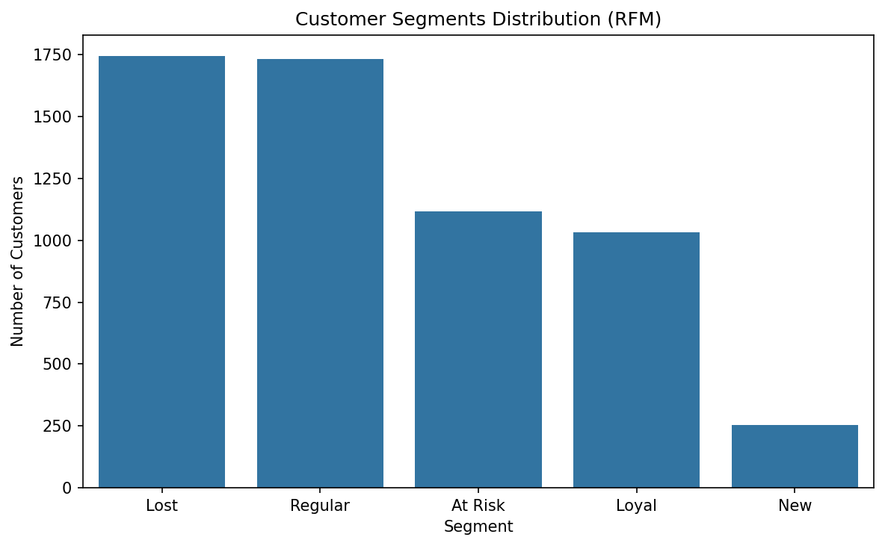

# 👥 Customer Segmentation — RFM Analysis

## 🔎 Overview

This project performs **RFM analysis** (Recency, Frequency, Monetary) to segment customers based on their purchasing behavior.  
**Goal:** identify **Loyal**, **New**, **At Risk**, and **Lost** customers and quantify their value to the business.

Dataset: [Online Retail II](https://www.kaggle.com/datasets/lakshmi25npathi/online-retail-dataset)

---

## 🧰 Tech Stack

- **Python**: pandas, numpy
- **Visualization**: matplotlib, seaborn
- **Environment**: Jupyter Notebook

---

## 📁 Project Structure

Customer_Segmentation_RFM/
│── data/
│ └── online_retail.xlsx
│── images/
│ └── rfm_segments.png
│── notebooks/
│ └── rfm_analysis.ipynb
│── requirements.txt
└── README.md

---

## 🧪 Methodology

1. **Clean** data: remove returns/duplicates, filter positive quantities, compute `TotalPrice`.
2. **Build RFM table** at the **CustomerID** level:
   - **R (Recency):** days since last purchase
   - **F (Frequency):** number of invoices
   - **M (Monetary):** total spend
3. **Score** each metric into quartiles → `R_Score`, `F_Score`, `M_Score`.
4. Combine into **RFM_Score** and map to **Segments** (Loyal, New, At Risk, Lost, Regular).
5. **Visualize** distribution of segments and summarize average R/F/M per segment.

---

## 📊 Key Insights (replace with your results)

- **Loyal** customers show the highest Monetary value and above-average Frequency.
- **At Risk** customers have long Recency and still meaningful Monetary — targeted reactivation can pay off.
- A small **VIP**-like group (high F & M) contributes disproportionally to revenue (Pareto pattern).
- **New** customers can be guided to the next purchase via cross-sell bundles.

---

## 🖼 Visualizations



---

## 🚀 How to Run

```bash
git clone https://github.com/Blladerunner/customer-segmentation-rfm-analysis.git
cd customer-segmentation-rfm-analysis

python -m venv .venv
.\.venv\Scripts\Activate.ps1    # Windows
# source .venv/bin/activate     # macOS/Linux

pip install -r requirements.txt
python -m notebook notebooks/rfm_analysis.ipynb

```
